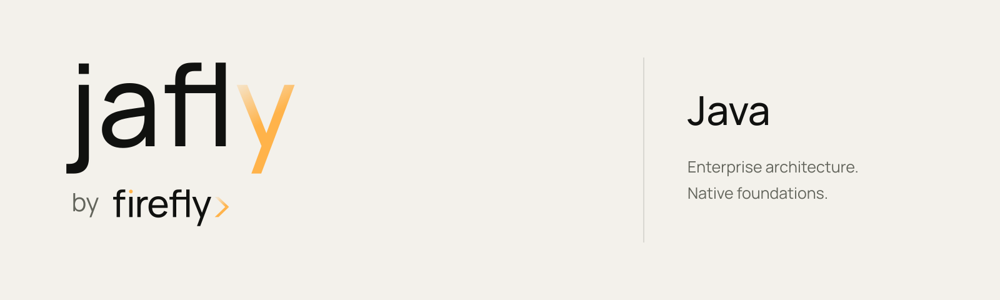

# jafly by example

<picture>
  <source media="(prefers-color-scheme: dark)" srcset="art/brand/banner-dark.png"/>
  
</picture>

> *From Spring Boot to a connected enterprise architecture.*

The canonical, build-it-yourself guide to **jafly**, the Java member of **Framework by Firefly** — a metaframework on top of Spring Boot (WebFlux · Project Reactor · R2DBC). You build one real application, a personal-loan origination service (**Lumen Lending**), from an empty folder to a secured, observable, event-driven, three-tier system — making every concept concrete before the next.

Published by the **Firefly Software Foundation** under Apache-2.0, in **American English** and **Spain Spanish (es-ES)**.

## What makes this book different

Every code listing in these pages is a **verbatim slice** of the companion Maven reactor under [`samples/lumen-lending`](samples/lumen-lending), which is **built and tested in CI**. When prose drifts from working code, the build fails. What you read is what actually compiles and passes its tests.

## Building the book

The book is a print-grade EPUB + PDF produced by a self-contained Python (WeasyPrint) pipeline.

```bash
# one-time
python3 -m venv build/.venv
./build/.venv/bin/pip install -r build/requirements.txt

# build (macOS — uses the DYLD shim for cairo/pango)
./build/run.sh --config book.yaml        # English  -> dist/firefly-java-by-example.{epub,pdf}
./build/run.sh --config book.es.yaml     # Spanish  -> dist/firefly-java-by-example-es.{epub,pdf}

# build (Linux / CI)
./build/build-book.sh --config book.yaml
```

Use JDK 25 for the companion application and verify that `mvn -version` reports that JDK. The published framework dependencies used by this sample target Java 25.

Verify the sample reactor, book tooling, and both editions’ listings:

```bash
mvn -f samples/lumen-lending/pom.xml verify
./build/.venv/bin/python -m pytest tests -q
./build/.venv/bin/python build/verify_code.py manuscript samples/lumen-lending
./build/.venv/bin/python build/verify_code.py manuscript-es samples/lumen-lending
```

## Cover and interior artwork

The English and Spanish manifests select separate front and back covers from
`art/`. PDF covers occupy the complete 7.5 × 9.25 inch trim page, without running
headers or page numbers. EPUB editions include localized cover and back-cover
documents at the beginning and end of the reading order, while retaining the
chapter navigation. The interior uses the approved jafly logo on title and part
pages, compact numbered chapter banners, and the shared paper, charcoal, amber
and gold palette. Chapter titles come from the localized manifests when the
manuscript does not supply a heading. Technical prose, diagram geometry, and
verbatim listings are preserved.

The shared **Framework by Firefly** brand kit owns the cover design. Validate the
checked-in outlined SVGs and 1500 × 1850 PNGs before rebuilding:

```bash
./build/.venv/bin/python build/gen_cover.py
# To import an updated canonical set:
./build/.venv/bin/python build/gen_cover.py --source /path/to/Framework-Brand-Kit/11-Books/java
```

On macOS, prefix these commands with
`DYLD_FALLBACK_LIBRARY_PATH="$(brew --prefix)/lib"` if Cairo is not already on the
loader path. The tool validates all four covers before copying them, and can
rasterize missing PNGs from their outlined SVGs. It does not generate a new cover
design. See [artwork provenance](art/BRAND-PROVENANCE.md) for ownership and print
boundaries.

## Releases

The redesigned English and Spanish editions are published together as
[`books-2026.10.08`](https://github.com/fireflyframework/fireflyframework-java-book/releases/tag/books-2026.10.08):

| Edition | PDF | EPUB |
| --- | --- | --- |
| English | [Download PDF](https://github.com/fireflyframework/fireflyframework-java-book/releases/download/books-2026.10.08/firefly-java-by-example.pdf) | [Download EPUB](https://github.com/fireflyframework/fireflyframework-java-book/releases/download/books-2026.10.08/firefly-java-by-example.epub) |
| Español | [Descargar PDF](https://github.com/fireflyframework/fireflyframework-java-book/releases/download/books-2026.10.08/firefly-java-by-example-es.pdf) | [Descargar EPUB](https://github.com/fireflyframework/fireflyframework-java-book/releases/download/books-2026.10.08/firefly-java-by-example-es.epub) |

Book-only editions use a `books-YYYY.MM.DD` tag. The existing CalVer
(`vYY.MM.PATCH`) workflow remains available for subsequent technical editions.

## Scope

This book covers **jafly**, the Java family. The pyfly, larafly, rsfly and netfly
frameworks, Firefly Agentic, the `agentic-bridge` and frontend projects have their
own documentation and are outside this book's scope.

---

*Copyright © 2026 Firefly Software Foundation. Licensed under Apache-2.0.*
